# Seul-Ki Kim

## Career

- **Android Developer** ( 2018-10 ~ )
- **Bigdata Researcher** ( 2017-02 ~ 2018-09 )

## Education

Konkuk University, Computer Engineering, Software Engineering

## Skills & Experience

- **Programming Languages**

  &emsp;&emsp;
  &emsp;
  &emsp;
  &emsp;
  &emsp;

- **Framework & Library**

  &emsp;
  &emsp;
  &emsp;
  &emsp;
  &emsp;
  &emsp;
  &emsp;
  &emsp;
  &emsp;
  &emsp;

* **Databases**

  &emsp;
  &emsp;

- **ETC**

  &emsp;
  &emsp;
  &emsp;
  &emsp;

## Corporate Projects

### 1. DOM-based Content Extractor

HTML Source를 DOM-based 기반 구조를 통하여 분석하여 해당 Source가 보유한 Content를 자동으로 추출하는 모듈

- **Duration** : 2017-09 ~ 2017-12 ( _3 months_ )
- **Role** : 알고리즘 코드 구현, JAR 배포 담당
- **Skills** : Java, [Text Density Algothm](http://ofey.me/papers/cetd-sigir11.pdf)
- **References** : [GitHub](https://github.com/rlatmfrl24/ContentExtractor)

### 2. IR-based Classification

입력 문장을 정규화하여 키워드 추출 및 유사 단어를 활용하여 검색 키워드를 추출한 후, 검색 엔진을 활용하여 관련 데이터를 제시해주는 모듈

- **Duration** : 2018-02 ~ 2018-09 ( _7 months_ )
- **Role** : TF-IDF 알고리즘 구현, RMI Server 구축 및 검색엔진 구축 담당, Word2Vec 모듈 마이그레이션 담당, RMI Client JAR 배포
- **Skills** : Java, RMI, [NLP(KoNLPy)](https://konlpy-ko.readthedocs.io/ko/v0.4.3/), [TF-IDF Algorithm](https://ko.wikipedia.org/wiki/Tf-idf), [Word2Vec](https://en.wikipedia.org/wiki/Word2vec), [Solr](https://lucene.apache.org/solr/)

### 3. Freight Forwarding Android Application

해운물류업에서 활용되는 Freight 거래 플랫폼 전용 Android Application 개발 참여

&emsp;
&emsp;
&emsp;
&emsp;
&emsp;
&emsp;
&emsp;

- **Duration** : 2018-10 ~ 2021-04
- **Role** : Port 선택 및 즐겨찾기 모듈 및 화면 개발 담당, GitLab 관리 담당
- **Skills** : RxKotlin, Dagger2, Room, Retrofit, RxLifeCycle, Stetho, Timber
  - Lottie, Retrofit을 활용한 Login Module 구현
  - RxKotlin, RxLiftCycle을 활용한 Rx 프로그래밍
  - Treeview Library를 활용한 계층형 List 구현
  - ViewPager2-TabLayout를 활용한 Route 선택 화면 구현
  - ListAdapter를 활용한 RecyclerView 구현
  - RecylcerView Drag & Drop 구현

### 4. Freight Forwarding Web

해운물류업에서 활용되는 Freight 거래 플랫폼 전용 Web 개발 참여

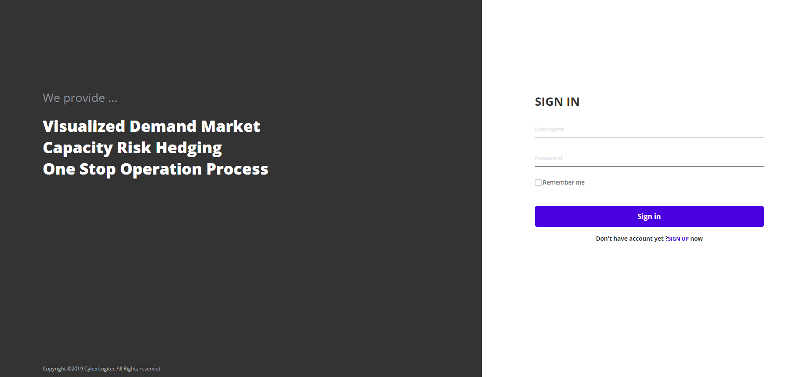&emsp;
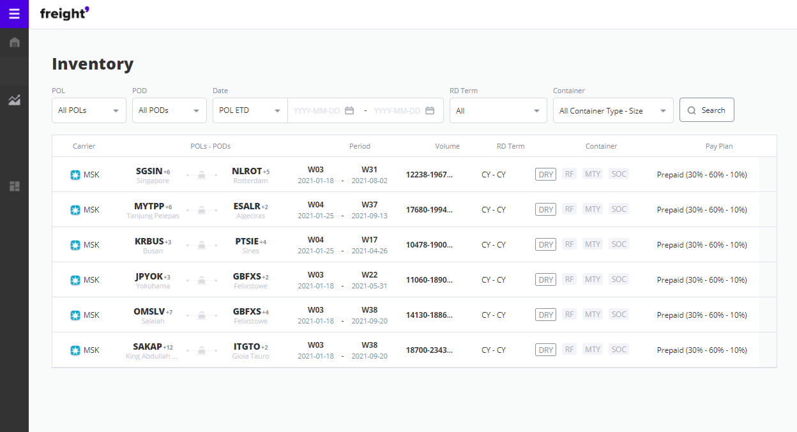&emsp;
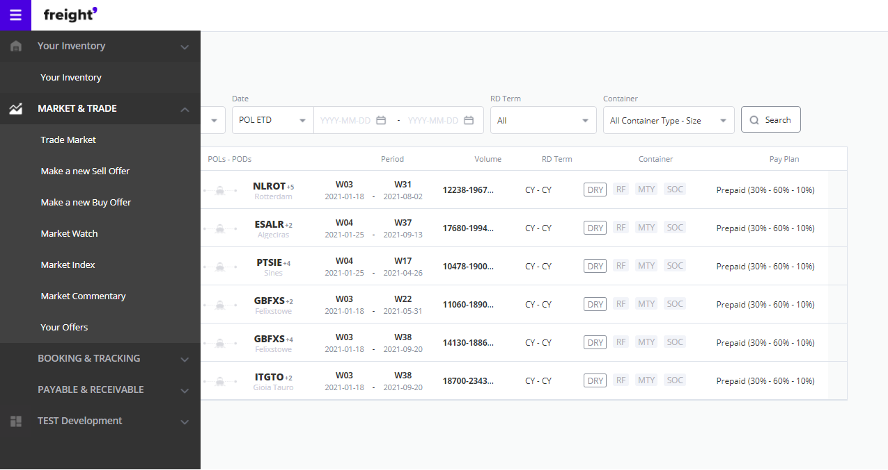&emsp;
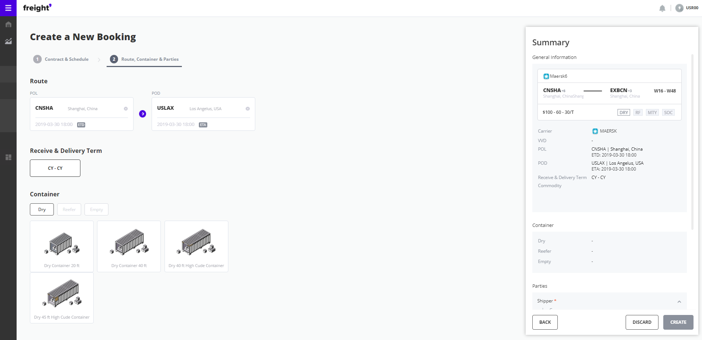&emsp;
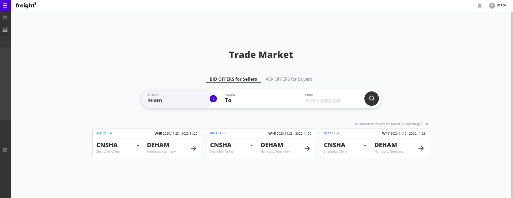&emsp;

- **Duration** : 2020-10 ~ 2021-04
- **Role** : Trade 상품 등록 화면, Booking 신청 및 조회 화면 개발 담당
- **Skills** : ReactJS, MobX, Javascript
  - Publishing 완료된 Booking 신청 및 조회 화면에 Javascript를 통해 데이터 연결 및 제어 개발 담당
  - ReactJS를 활용하여 Trade 상품 등록 개발 담당
  - Selenium 및 Python을 활용한 자동 상품 등록 모듈 개발 담당

### 5. Dangerous Goods Inspection Management System

해운물류업계에서 사용되는 위험물 검사 신청 시스템에 활용되는 Android Application Mock-up 개발 담당

[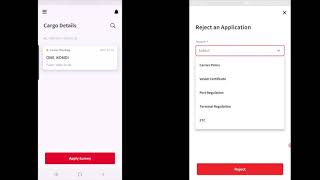](https://youtu.be/VsKC5VWjblo) 

**클릭하면 시연 동영상을 보실수 있습니다**

- **Duration** : 2020-09 ~ 2020-12
- **Role** : Androidp Application Mock-up 전체 개발
- **Skills** : MVVM Architecture, Databinding, Koin, Timber, Room, Retrofit, Lottie, Dexter
  - MVVM Architecture를 활용한 프로젝트 구조 설계
  - 화주, 검사원, 선사용 화면 개발 및 연동 개발
  - Blockchain 모듈 및 Application 연동 개발
  - Databinding 적용
  - Koin을 활용한 DI Framework 적용
  - Room을 활용한 Local DB 활용 및 내부 검색 모듈 구현
  - Retrofit & Okhttp를 활용한 API 통신 모듈 구현
  - Dexter를 활용한 Permission 모듈 구현

### 6. Container Mobile M&R System
Container M&R 센터에 입고되는 컨테이너의 인식 넘버를 촬영한 이미지에 문자인식을 수행하여 컨테이너 정보를 받아와 수리 내역 및 입고 상황을 관리해주는 시스템 개발

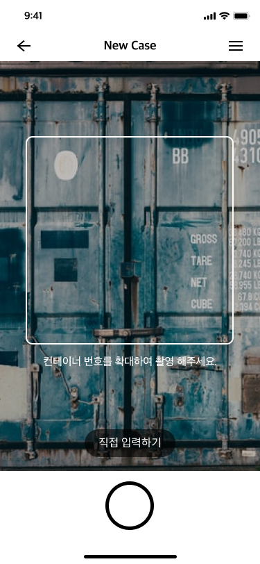&emsp;
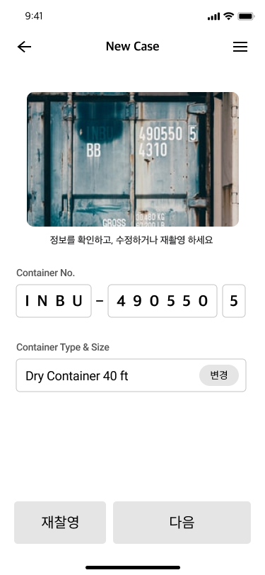&emsp;
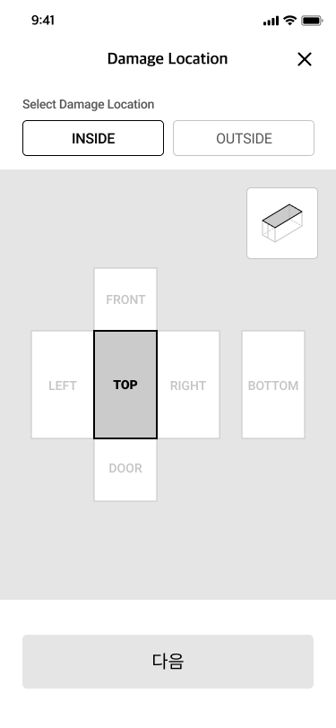&emsp;
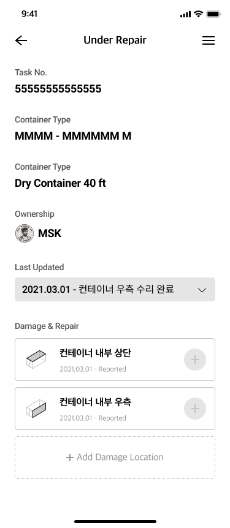&emsp;
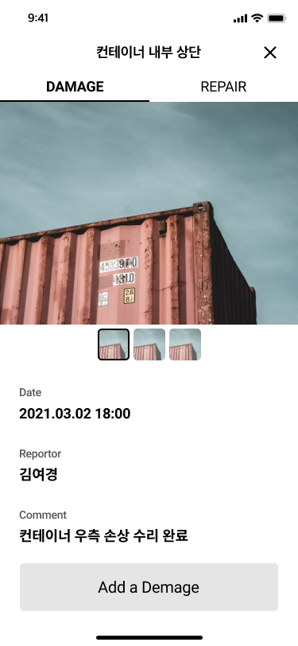&emsp;

- **Duration** : 2021-05 ~ 2022-02
- **Role** : Android Application 개발
- **Skills** : MVVM Architecture, Databinding, Koin, Timber, Room, Retrofit, Dexter, Camera API
     - 이미지 문자 인식 라이브러리(ConPDS) 검토 및 적용
   - 인식된 컨테이너 넘버를 활용하여 서버로부터 Container 정보와 수리 상황 및 내역을 받는 기능 구현
   - 컨테이너의 구역별 수리 상황 및 수리 요청 사항을 기록할 수 있도록 해주는 UI 구현
   - 컨테이너 수리 상황 변동에 따른 관련 사용자에게 알림 서비스 지원 기능 구현
   - Android Camera API를 활용한 사진 촬영 및 이미지 처리 모듈 개발
   - Retrofit을 활용한 REST-API 연결
   - Room DB와 Databinding을 활용한 CRUD 수행 및 실시간 업데이트 UI 적용
   - Dexter를 활용한 Permission 관리 및 권한 취득 프로세스 구현
## Personal Projects

### 1. Article Crawl & Management System

자주 방문하는 웹사이트의 신규 게시물들을 크롤링하여 사용자에게 보여주는 시스템

&emsp;
&emsp;
&emsp;
&emsp;

- **Duration** : 4 months
- **Skills** : Node.js, Firebase, React JS, AndroidX
  - Firebase를 활용한 Serverless Back-End 구현
  - Koin를 활용한 MVVM Architecture 적용
  - Recyclerview-ListAdapter 적용
  - Room-LiveData를 활용한 Data-Binding 적용
  - React-MobX를 활용한 Data Store 구현
  - Gestalt Library를 활용한 Web UI 구현
- **References** : [Back-End](https://github.com/rlatmfrl24/applemint-firebase), [Web](https://rlatmfrl24.github.io/applemint-web), [Android](https://rlatmfrl24.github.io/applemint)

### 2. Craftman Bartender

조주기능사 실기시험 모의테스트용 연습용 앱

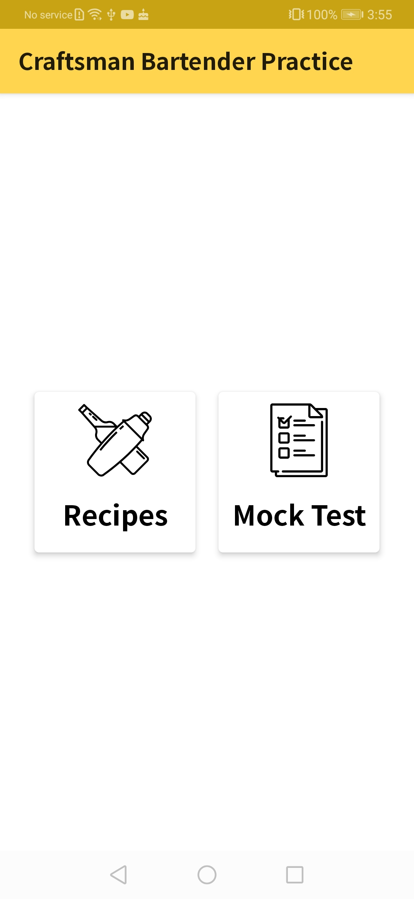&emsp;
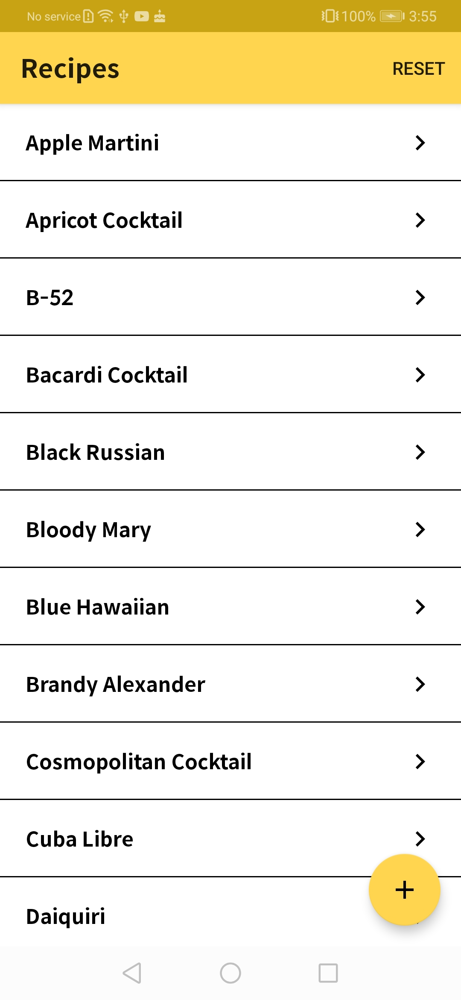&emsp;
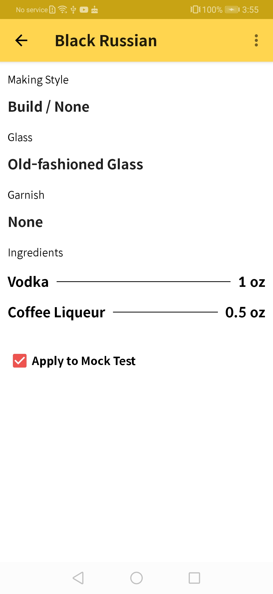&emsp;
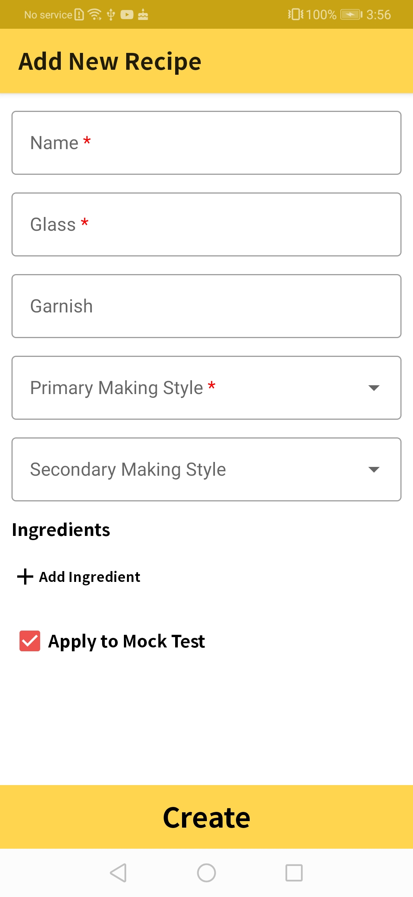&emsp;
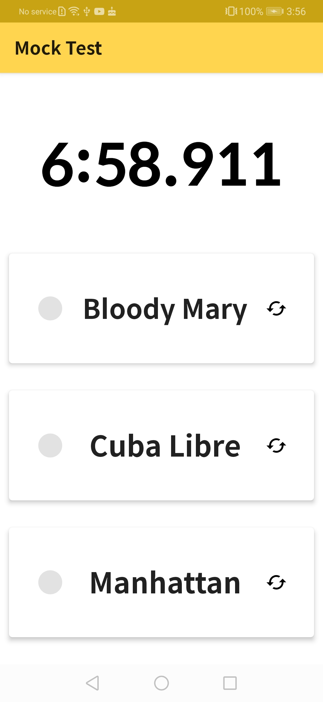&emsp;
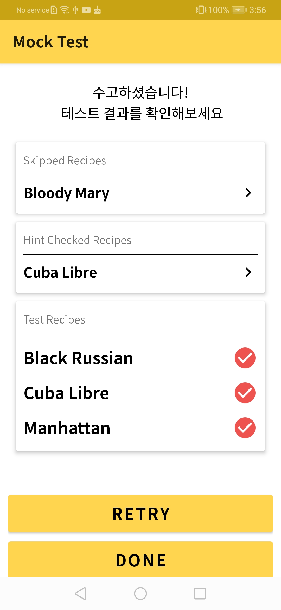&emsp;

- **Duration** : 1 months
- **Skills** : AndroidX, MVVM, Koin, Room, Coroutine, Firebase, Material UI
  - Firebase를 활용한 Serverless Back-End 구현
  - Koin를 활용한 MVVM Architecture 적용
  - Coroutine을 활용한 비동기 프로세스 처리
  - Room을 활용한 Local DB 적용
  - Databinding 적용
  - Material UI를 활용한 UI Framework 적용
- **References** : [Android](https://github.com/rlatmfrl24/CraftsmanBartender)

### 3. Meerkat (Linked Stock Service)

[https://meerkat-smtp.web.app/](https://meerkat-smtp.web.app/)

RSS를 통해 기사를 수집하고 해당 기사와 연관된 키워드를 매칭시키고 매칭된 키워드과 연관된 주식을 보여주며 해당 주식의 영향도를 보여주는 Web Service

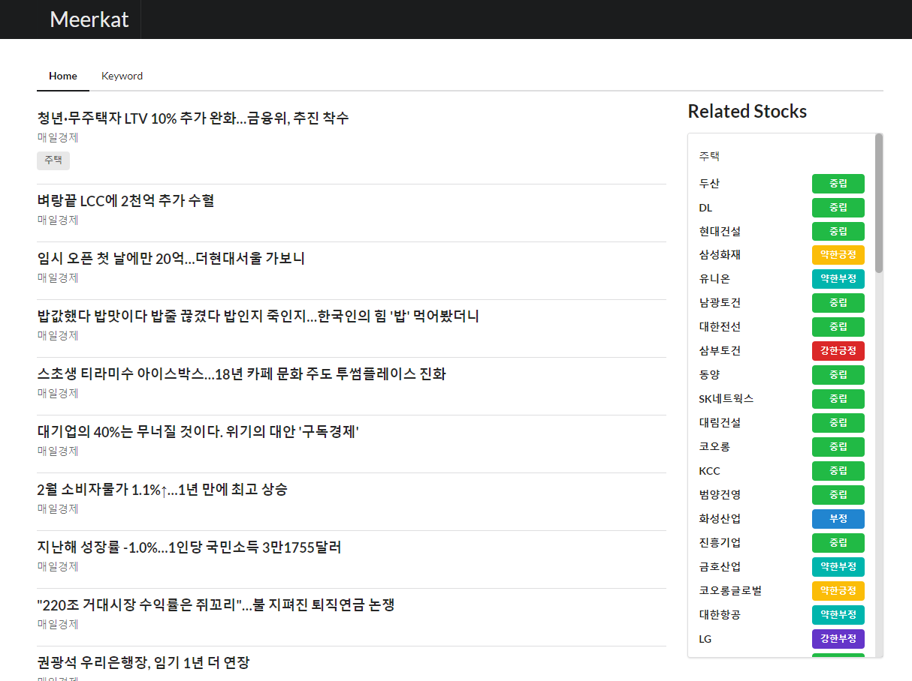&emsp;
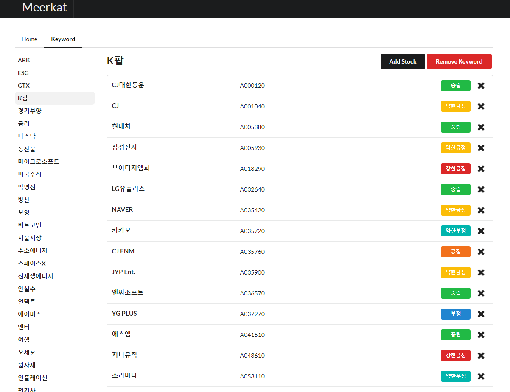&emsp;

- **Duration** : 2 weeks
- **Skills** : Typescript, Next.JS, Semantic-UI React, Recoil, Firebase
  - Firebase를 활용한 Serverless Back-End 구현
  - Firebase Functions을 활용한 RSS 수집 및 매칭 모듈 구현
  - Next.JS를 활용한 Web 화면 구성
  - Recoil을 활용한 Data Store 구축
  - Semantic UI React를 활용한 UI Framework 구축 및 활용
- **References** : [Firebase+Web](https://github.com/smtp-ku/Meerkat)

### 4. Don't Panic (Metaverse Tutoring Platform)
현대크래들 주관 오픈 이노베이션 플랫폼(**제로원데이 2021**) 크리에이터 부문 출품작

대면교육의 경험을 충분히 담아내기 어려운 온라인 교육 환경에 대한 개선을 위한 메타버스 플랫폼 개발

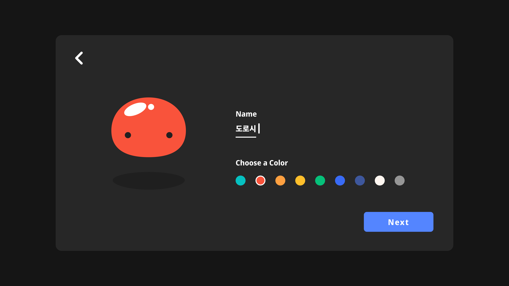&emsp;
&emsp;
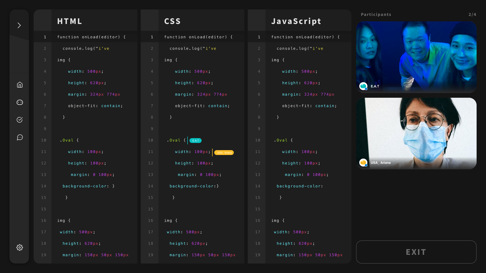&emsp;

- **Duration** : 2021-09 ~ 2021-11
- **Skills** : Typescript, Next.JS, React, Recoil, Firebase
  - Firebase를 활용한 Serverless 구현
  - Next.JS를 활용한 Web 화면 구성
  - Recoil을 활용한 Data Store 구축
  - 객체 좌표 인식 및 키보드 입력을 통한 객체 위치 변화 기능 구현
  - 화상 통화 및 실시간 채팅 라이브러리 적용 및 Customizing 수행
  - 실시간 코드 공유 시스템 구축 및 UI 개발
- **References** : [Site](http://zer01neday.com/2021/) / [Youtube](https://www.youtube.com/watch?v=4RTtzIPCmkw)

## Contact Me

- Email : 397love@gmail.com

 

_Thank you for reading my resume. If you want to contact me, Please send me an email._

