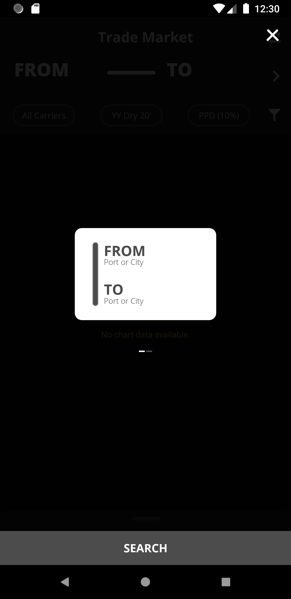
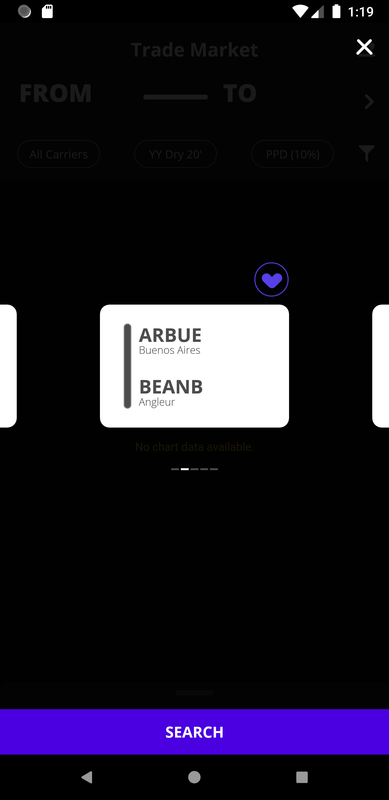
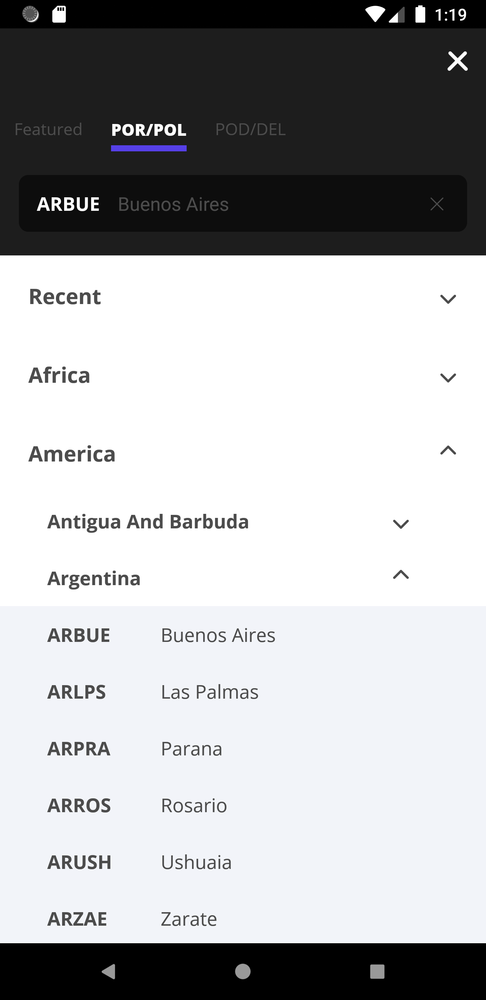
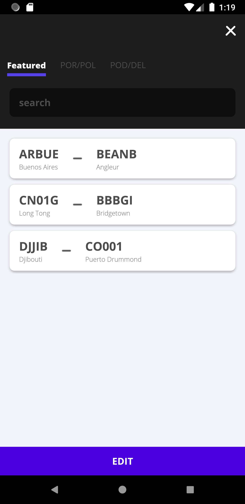
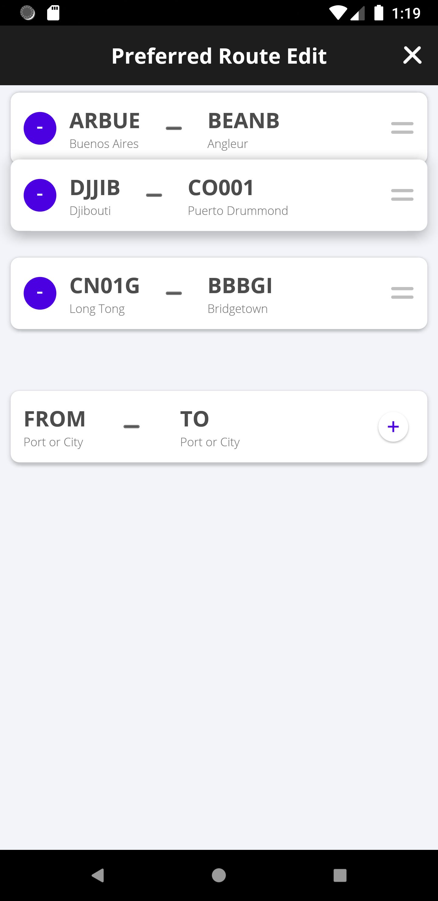
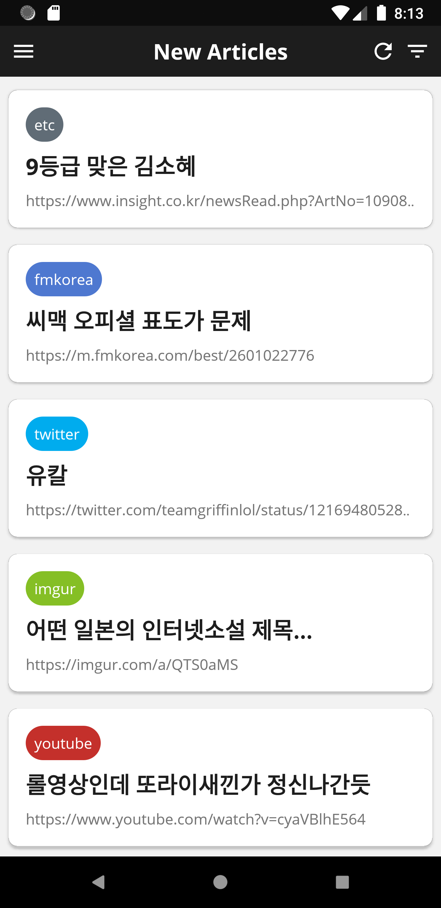
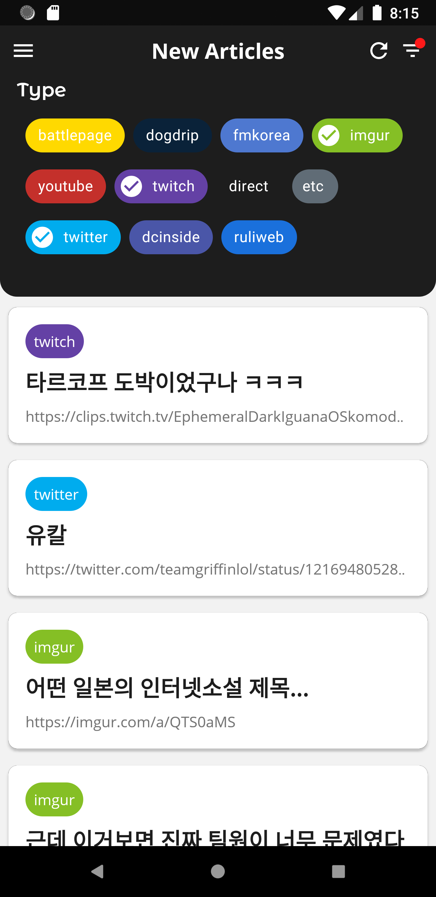
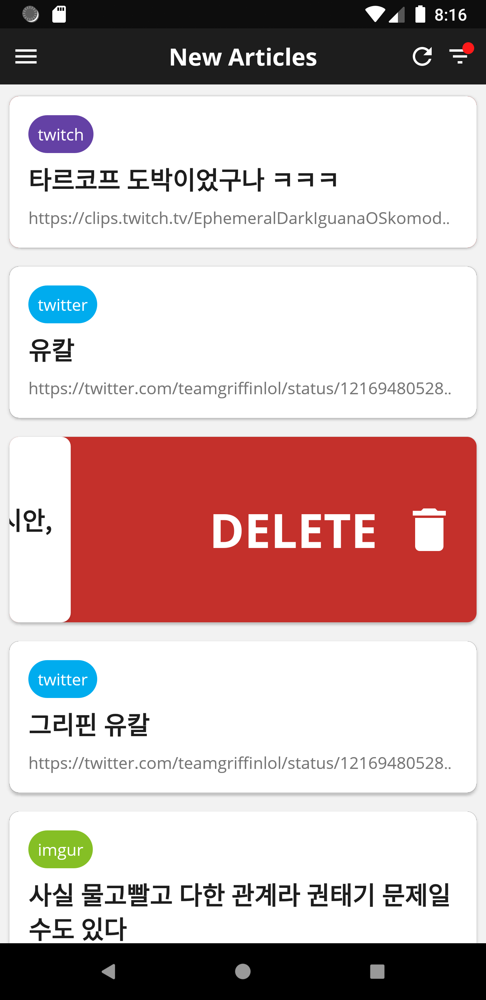
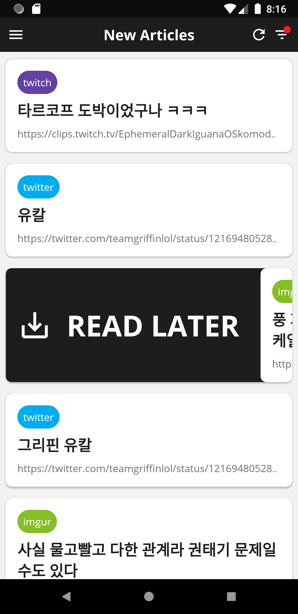

# Seul-Ki Kim

## Career

- **Android Developer** ( 2018-10 ~ )
- **Bigdata Researcher** ( 2017-02 ~ 2018-09 )

## Education

Konkuk University, Computer Engineering, Software Engineering

## Skills & Experience

- **Programming Languages**

  &emsp;&emsp;
  &emsp;
  &emsp;
  &emsp;
  &emsp;

- **Framework & Library**

  &emsp;
  &emsp;
  &emsp;
  &emsp;
  &emsp;
  &emsp;
  &emsp;
  &emsp;
  &emsp;
  &emsp;

* **Databases**

  &emsp;
  &emsp;

- **ETC**

  &emsp;
  &emsp;
  &emsp;
  &emsp;

## Corporate Projects

### 1. DOM-based Content Extractor

HTML Source를 DOM-based 기반 구조를 통하여 분석하여 해당 Source가 보유한 Content를 자동으로 추출하는 모듈

- **Duration** : 2017-09 ~ 2017-12 ( _3 months_ )
- **Role** : 알고리즘 코드 구현, JAR 배포 담당
- **Skills** : Java, [Text Density Algothm](http://ofey.me/papers/cetd-sigir11.pdf)
- **References** : [GitHub](https://github.com/rlatmfrl24/ContentExtractor)

### 2. IR-based Classification

입력 문장을 정규화하여 키워드 추출 및 유사 단어를 활용하여 검색 키워드를 추출한 후, 검색 엔진을 활용하여 관련 데이터를 제시해주는 모듈

- **Duration** : 2018-02 ~ 2018-09 ( _7 months_ )
- **Role** : TF-IDF 알고리즘 구현, RMI Server 구축 및 검색엔진 구축 담당, Word2Vec 모듈 마이그레이션 담당, RMI Client JAR 배포
- **Skills** : Java, RMI, [NLP(KoNLPy)](https://konlpy-ko.readthedocs.io/ko/v0.4.3/), [TF-IDF Algorithm](https://ko.wikipedia.org/wiki/Tf-idf), [Word2Vec](https://en.wikipedia.org/wiki/Word2vec), [Solr](https://lucene.apache.org/solr/)

### 3. Freight Forwarding Applicatopn

해운물류업에서 활용하는 Freight 거래 플랫폼 전용 Android Application 개발 참여

&emsp;
&emsp;
&emsp;
&emsp;
&emsp;
&emsp;
&emsp;

- **Duration** : 2018-10 ~ (진행중)
- **Role** : Sign-In 모듈 및 화면 개발 담당, Port 선택 및 즐겨찾기 모듈 및 화면 개발 담당, GitLab 관리 담당
- **Skills** : Kotlin, RxKotlin, Dagger2, Room, Retrofit, RxLifeCycle, Stetho, Timber

## Personal Projects

### 1. Article Crawl & Management System

자주 방문하는 웹사이트의 신규 게시물들을 크롤링하여 사용자에게 보여주는 시스템

&emsp;
&emsp;
&emsp;
&emsp;

- **Duration** : 4 months
- **Skills** : Node.js, Firebase, React JS, Android
- **References** : [Back-End](https://github.com/rlatmfrl24/applemint-firebase), [Web](https://rlatmfrl24.github.io/applemint-web), [Android](https://rlatmfrl24.github.io/applemint)

## Contact Me

- Email : 397love@gmail.com

 

_Thank you for reading my resume. If you want to contact me, Please send me an email._

